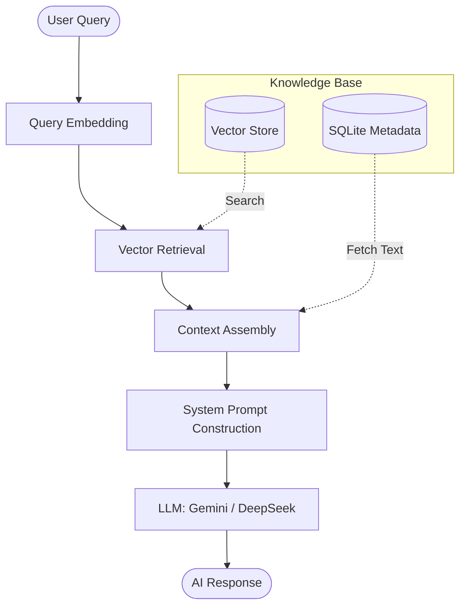

# Bhoomika AI: Mechanism & Architecture

**Bhoomika** is the AI Domain Assistant for the BhoomiSetu ecosystem. It is designed to provide natural language assistance to citizens and registrars regarding land laws, legal procedures, and system usage.

## 1. Core Architecture: RAG (Retrieval-Augmented Generation)

Bhoomika operates on a **RAG pipeline**, which ensures that the AI's responses are grounded in authoritative data (land laws, documentation) rather than just general knowledge.

## 2. Technical Components

### 2.1 Embedding Model
- **Model**: `BAAI/bge-large-en-v1.5` (Local execution via SentenceTransformers).
- **Function**: Converts text into 1024-dimensional vectors. It includes a specific query prefix: `"Represent this query for retrieving documents:"` to optimize retrieval accuracy.

### 2.2 Vector Storage
- **Mechanism**: Hybrid storage using `numpy` for high-speed vector similarity (Cosine Similarity) and `SQLite` for metadata management.
- **Granularity**: Documents are split into overlapping chunks to maintain context continuity.

### 2.3 Large Language Models (LLM)
Bhoomika is backend-agnostic and supports:
- **Google Gemini 2.0 Flash**: Preferred for high-speed, high-context legal reasoning.
- **DeepSeek (via OpenRouter)**: Used as a robust alternative for general assistance.

## 3. The Query Workflow

1.  **Retrieval Step**:
    - The user message is embedded in real-time.
    - The system performs a **Similarity Search** against thousands of indexed document chunks (Land Acquisition Acts, Registration Rules, etc.).
    - The top-K (most relevant) chunks are selected.

2.  **Augmentation Step**:
    - The retrieved chunks are injected into a specialized **System Prompt**.
    - This prompt instructs the AI: *"You are Bhoomika... Use the following context to answer... If not in context, mark as general knowledge."*

3.  **Generation Step**:
    - The augmented prompt is sent to the LLM.
    - The LLM generates a response that cites specific sections or laws if found in the context.

## 4. Ingestion Pipeline

To keep Bhoomika updated, the system includes an ingestion script (`ingest_documents.py`) that:
1.  Loads PDF/Text documents from the `documents/` directory.
2.  Cleans and chunks the text.
3.  Generates embeddings for each chunk.
4.  Updates the `faiss_index` and `bhoomika.db`.

---
**Role in BhoomiSetu**: Bhoomika bridges the gap between complex legal jargon and common citizen needs, acting as the intelligent interface for the decentralized land registry.
